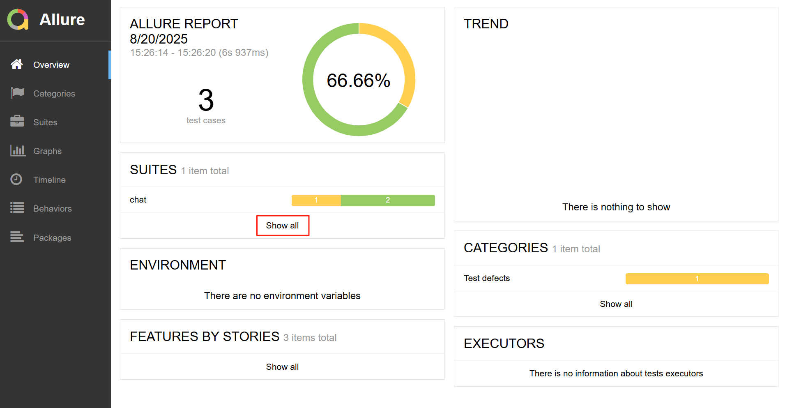
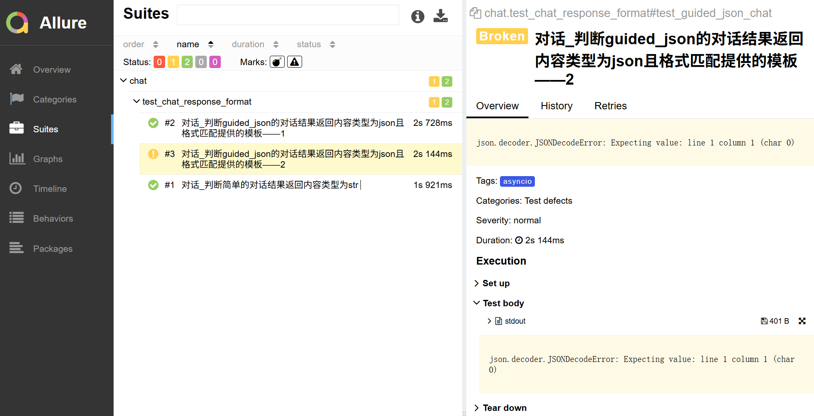
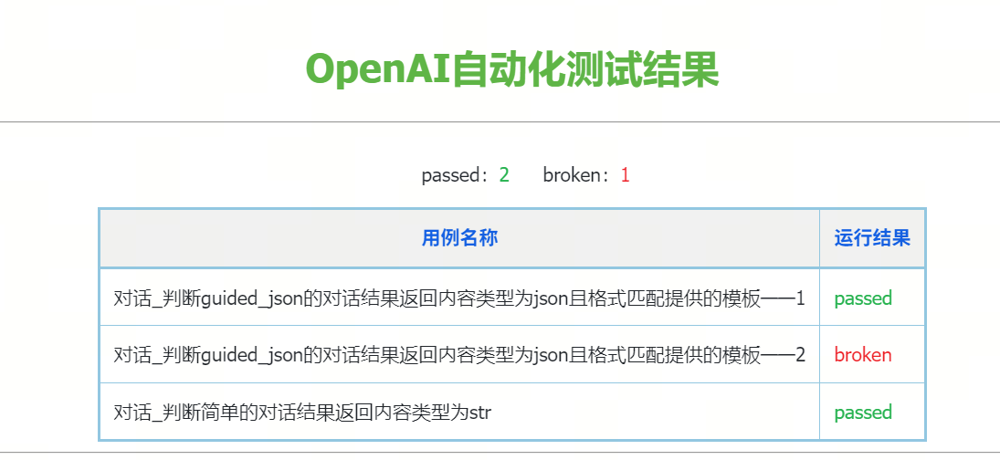

# openai-test

## 1.Allure环境配置
Java安装+环境变量设置：https://blog.csdn.net/qq_43329216/article/details/118385502
allure安装：https://blog.csdn.net/weixin_43979930/article/details/146004741
pip3 install allure-pytest
安装包在106服务器 /home/weight/openAI-test 
## 2.项目介绍
测试项目使用pytest工具编写、执行用例使用assert断言结果，通过allure工具汇总测试结果，可以通过web界面查看测试结果
项目地址：http://git.xcoresigma.com/xcore-sigma/openai-test
编写规范：每个用例必须有assert断言结果
## 3.项目结构
1.用例文件夹分为chat和text分别对应chat.completions和completions
2.环境+测试服务信息配置：config/env_settings.tmol
## 4.用例执行命令
1. 执行对话接口用例 pytest --env [测试环境] ./chat/ --allure-results
2. 执行某一文件 pytest chat/test_chat_stream.py
3. 执行某一文件下某一用例 pytest chat/test_chat_stream.py::test_stream_with_option_include_usage_true
4. 执行整个项目 pytest . --alluredir allure-results
5. 生成allure report：allure generate allure-results/ -o allure-report --clean
6. web界面打开allure report：allure open allure-report/

## 5.用例report汇总并发送邮件
执行python3 get_info.py（需要修改邮件收件人信息，如果执行用例结果路径与#4不一致需要进行修改第35行）
结果如下

## 6.自动化环境信息动态配置
命令：dynaconf write toml -v BASE_URL=http://10.208.130.44:2055/v1 -v MODEL=qwen3 -p config/env_settings.toml -e 45 -y    
参数含义：-e：环境名称 -v：环境变量
